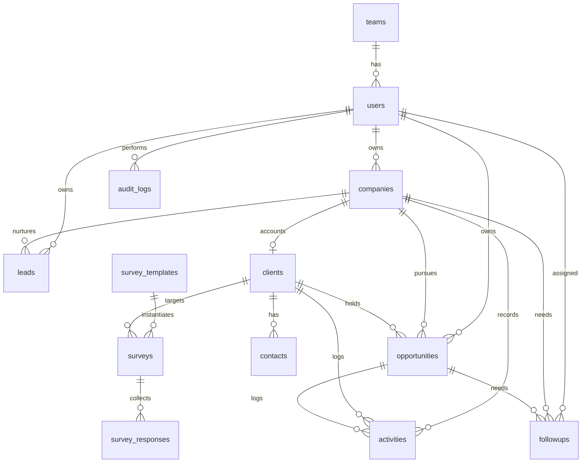

# 03 — Data Model

## 1. ERD (Mermaid)

**Root rule:** `companies` own identity; leads/opportunities hang off a company from birth; the client is created for a company only when its first deal is won (`converted` on leads is system-set, never manual; one active lead per company; lost deals change nothing).

## 2. Tables (Postgres; `id` = bigint PKs — internal only; timestamps + `deleted_at` soft delete)
- `teams(id, name, region)` — e.g. Manila, Cebu, Davao.
- `users(id, team_id→teams, name, email unique, password, role enum[superadmin,admin,manager,sales_rep], is_active, last_login_at)`.
- `companies(id, owner_id→users, name, industry, address_city, address_province, contact_email, contact_phone, source)` — the root every record hangs off.
- `clients(id, owner_id→users, company_id→companies, name, industry, size_band, address_city, address_province, contact_email, contact_phone, status enum[prospect,active,inactive,blacklisted], source, created_from_lead_id nullable)` — born from won deals, one per company.
- `contacts(id, client_id, full_name, position, email, phone, is_primary)`.
- `leads(id, owner_id→users, company_id→companies, company_name, contact_name, contact_position, contact_email, contact_phone, headcount_needed, positions, source enum[…], status enum[new,contacted,qualified,unqualified,converted(system-only)], score 0-100, notes, converted_client_id nullable)`.
- `opportunities(id, company_id→companies, client_id nullable→clients, owner_id, title, stage enum[…], value_centavos, probability %, terms…, expected_close_date, lost_reason/won_at/lost_at nullable)` — pre-client deals carry only the company.
- `activities(id, owner_id, company_id nullable, client_id nullable, opportunity_id nullable, type enum[…], subject, body, outcome, occurred_at, attachments jsonb)` — pre-client touchpoints carry the company.
- `survey_templates(id, name, type enum[nps,csat,custom], questions jsonb, is_active)`.
- `surveys(id, template_id, client_id, sent_by, channel enum[link,email_mock,sms_mock], token unique, due_at, status enum[draft,sent,responded,expired])`.
- `survey_responses(id, survey_id, score, answers jsonb, comment, responded_at)`.
- `followups(id, owner_id, company_id nullable, client_id nullable, opportunity_id nullable, title, due_at, priority enum[…], status enum[…], snoozed_until/escalated_to nullable)`.
- `notifications(id, user_id, type, title, body, read_at nullable, link nullable)`.
- `audit_logs(id, user_id, action, entity, entity_id, meta jsonb, created_at)`.

## 3. Conventions
- All money `integer` centavos; display `₱209,154` via `formatPHP()`.
- Phones stored E.164 (`+639171234567`); validate with regex `^\+63\d{10}$`.
- Indexes: `clients(owner_id,status)`, `leads(owner_id,status)`, `opportunities(stage,expected_close_date)`, `followups(owner_id,status,due_at)`, `activities(client_id,occurred_at)`, `surveys(token)`.
- Audit via `HasAuditLog` trait on write models; never hard-delete clients/opps (soft delete + `deleted_by` in meta).
